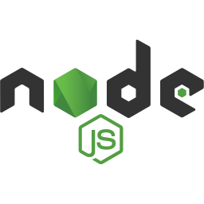
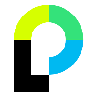

# project-ideas
Simple app for portfolio-projects-ideas-storidge with node.js, express, materializeCSS, passport, etc...

---

### In project i use:

---

### Hosted project

[Project Ideas](https://enigmatic-atoll-11788.herokuapp.com/)
